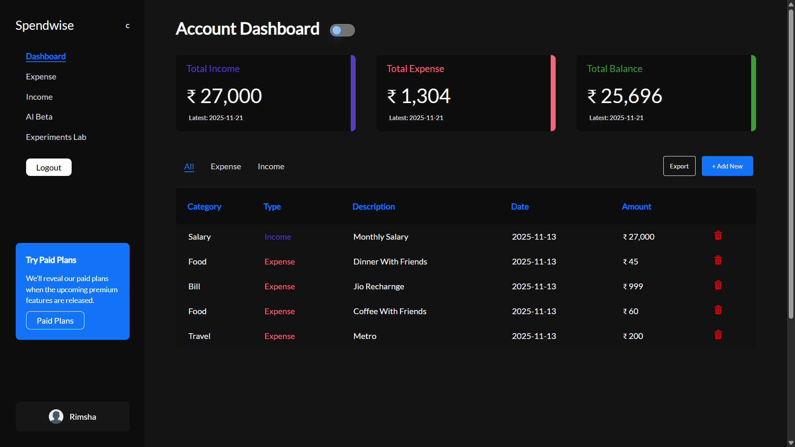

📊 Spendwise — Smart Expense Management System

  

Live Demo: [https://your-live-project-link.com](https://spendwise-mqxp.onrender.com/)

Author: Ali Arshad Khan

Spendwise is a modern, smart, and intuitive full-stack expense tracker that helps users manage finances effortlessly.
With AI-powered insights, responsive UI/UX, analytics, charts, and export features — Spendwise makes personal finance simple and stress-free.

📸 Dashboard Preview

  

🚀 Overview

Most people struggle with:

Tracking daily expenses
Understanding financial habits
Managing budgets
Analyzing spending patterns

Spendwise provides a centralized, visual, and intelligent platform to simplify all financial tracking.

💡 Why Spendwise Matters

Better financial clarity leads to:

Smarter decisions
Better savings
Reduced stress
Improved control over finances

Spendwise gives users a clear picture of where their money actually goes.

🔥 Features

AI-powered Smart Chatbot
User Authentication
Add/Delete Income & Expenses
Income & Expense Pages
Analytics & Charts
Fully Responsive UI
Experiment Labs
Export Options
Glass Theme

🔐 Session-based Authentication

Secure Login/Register
Session cookies used (no JWT)
Safe and stable identity handling

💰 Income & Expense Management

Add income & expenses
Delete transaction entries
Categorized & timestamped transactions
Separate Income & Expense pages

📈 Analytics & Charts

Recharts-powered dynamic graphs

📤 Export Options

Export transactions as PDF
Export transactions as Excel (.xlsx)

🧪 Experiment Labs

Testing grounds for upcoming tools/features

🎨 Modern UI/UX

Fully responsive
Clean layout
Glassmorphism theme
Smooth transitions and design consistency

🛠️ Tech Stack

Frontend

React
TailwindCSS
Recharts
Context API

Backend

Node.js
Express
MongoDB

🔄 User Flow

User registers/logs in (session created)

Dashboard loads with charts & analytics

User adds transactions

Insights update automatically

AI chatbot gives suggestions

User exports data as PDF/Excel

📦 Installation & Setup
# Install dependencies
npm install

# Start development server
npm run dev

Make sure backend .env (DB URI, session secret, etc.) is correctly configured.

📡 API Endpoints
Auth (Session-Based)
POST /auth/signup
POST /auth/login
GET  /auth/logout
GET  /auth/me

Transactions
POST   /transactions/add
GET    /transactions
DELETE /transactions/:id

AI
POST /ai/ask-ai

🔮 Future Improvements

🎤 Voice Assistant Integration

💰 Advanced budgeting alerts & prediction

🛠️ Additional financial tools

🎨 Multiple color themes

🤖 More advanced AI insights

📄 License

© 2025 Spendwise
Designed & Developed by Ali Arshad Khan
